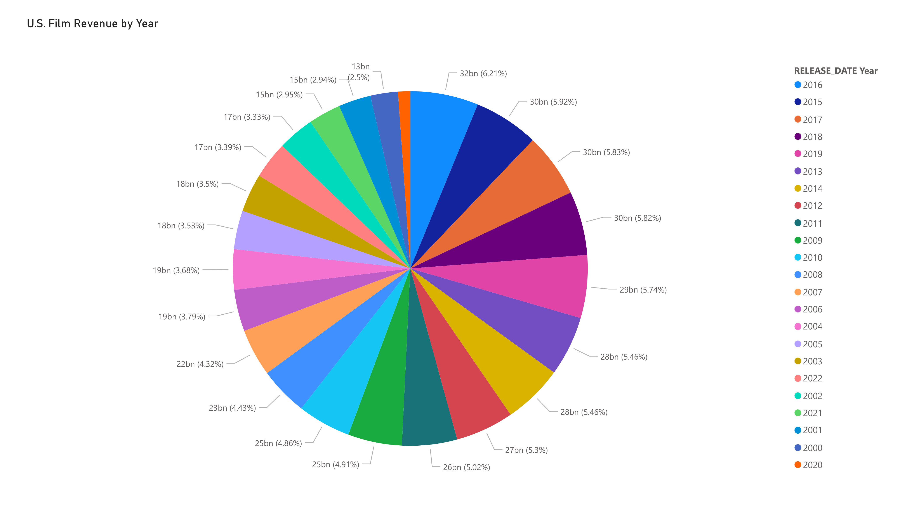

# The Movie Database Data

#### By Jarret Jeter

#### A python script to extract film data from The Movie Database API using the api wrapper [tmdbsimple](https://github.com/celiao/tmdbsimple).

## Technologies Used

* _azure data lake storage gen2_
* _power BI_
* _python_
* _pandas_
* _tmdbsimple_
* _typer_

## Description
The intent of this project was to get revenue data on the highest earning American films from 2000 to 2022, but seeing some of the data I wasn't entirely sure what makes a film "American"(Produced entirely in America? American setting? What if it's set in America but produced by the United Kingdom?). I settled on obtaining data for any films released in the US, foreign or not, and the revenue generated per year. 

The script uses three functions get_movies() to request the desired data from tmdb(saving each page of results to its own csv), merge_dfs() which runs after all pages are saved to a csv, merging them to a single one, and blobs_upload() to upload the data to your azure storage container after each batch of data completes.

## Setup/Installation Requirements
You'll need a [tmdb](https://www.themoviedb.org/) account to access the site's API as well as an [Azure](https://azure.microsoft.com/en-us/products/storage/data-lake-storage/) storage account.
* Clone this repository (https://github.com/jarretjeter/reddit-scraper.git) onto your local computer from github
* In VS Code or another text editor, open this project
* With your terminal, install a python3.8 virtual environment in the project's directory, activate it and enter the command 'pip install -r requirements.txt' to get the necessary dependencies.
* Create a file named "config.json" in the root directory and enter your tmdb API and Azure storage details into so the main.py script can access them.
* Once that's setup you can run the command 'get_movies' in the terminal along with the arguments you want to begin fetching the data.

## Known Bugs

* Don't currently have code written to check for any missing pages/csv's before merging together

## License

[MIT](https://github.com/jarretjeter/tmdbdata/blob/main/LICENSE.txt)

_Copyright (c) January 24 2023 Jarret Jeter_